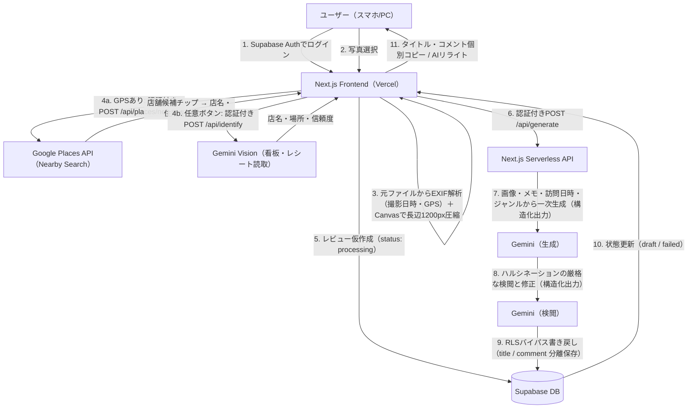

# 食べログ下書き生成・管理アプリ 完全仕様・開発プロセス報告書

本ドキュメントは、本プロジェクトで構築した「食べログ下書き生成・管理アプリ」の最終システム仕様、セキュリティ設計、AIワークフローのプロンプト設計、およびこれまでの開発プロセスと実装履歴をまとめた完全リファレンスです。

---

## 1. システム全体設計 ＆ アーキテクチャ

本システムは、セキュリティ保護（プライベートデータ保護）、運用コスト最小化（ストレージ不要）、および食べログの規約遵守を同時に満たすWebアプリケーションです。

### 全体アーキテクチャ・データフロー


---

## 2. データベース設計 (Supabase)

画像自体はクラウド上に永続保存せず、ブラウザ側からBase64形式で一時的にAPIに渡すため、Storageバケットは不要です。

### 2.1 テーブル定義: `tabelog_reviews`
| カラム名 | 型 | 制約 | 説明 |
| :--- | :--- | :--- | :--- |
| `id` | `uuid` | `PRIMARY KEY`, `DEFAULT gen_random_uuid()` | レコードの一意識別子 |
| `user_id` | `uuid` | `NOT NULL`, `references auth.users` | Supabase AuthのユーザーID（所有者を識別） |
| `shop_name` | `varchar` | `NOT NULL` | 店舗名 |
| `rating` | `numeric` | `NOT NULL`, `check (rating >= 1.0 and rating <= 5.0)` | 評価（1.0 〜 5.0） |
| `raw_memo` | `text` | `NULL` | ユーザーが入力した任意の体験メモ |
| `generated_review` | `text` | `NULL` | AIレビューの全文（「タイトル：…\nコメント：…」形式。旧レコード互換用） |
| `review_title` | `text` | `NULL` | AIレビューのタイトル（構造化出力から保存） |
| `review_comment` | `text` | `NULL` | AIレビューのコメント本文（構造化出力から保存） |
| `status` | `varchar` | `DEFAULT 'processing'`, `check (status in (...))` | 状態管理（`processing` / `draft` / `failed` / `posted_tabelog` / `posted_google` / `posted`） |
| `visit_date` | `date` | `NULL` | 訪問日（写真のEXIF撮影日から自動設定、手動修正可） |
| `visit_time` | `time` | `NULL` | 訪問時刻（EXIF撮影時刻から自動設定。AIプロンプトの時間帯文脈に使用） |
| `place_id` | `text` | `NULL` | 選択されたGoogle PlaceのID（表記ゆれのない店舗の一意キー。再訪検知・制覇マップの布石） |
| `place_lat` / `place_lng` | `double precision` | `NULL` | 選択された店舗の座標（写真の生GPSは保存しない） |
| `place_genre` | `text` | `NULL` | 店舗ジャンル（例: ラーメン屋）。AIプロンプトの文脈に使用 |
| `shop_location` | `text` | `NULL` | 店の場所の説明（例:「東京都中央区銀座付近」。AI推定・手入力可） |
| `latitude` / `longitude` | `double precision` | `NULL` | 写真のEXIF GPS座標（カードの地図リンクのフォールバックに使用） |
| `created_at` | `timestamptz`| `DEFAULT now()` | レコード作成日時 |

### 2.2 セキュリティ設計 (RLS Policy)
Supabaseの「Row Level Security (RLS)」を有効化し、**ログインしている本人しかデータを「参照・作成・編集・削除」できない**ポリシーを設定しています。
- **SELECT / INSERT / UPDATE / DELETE**: `auth.uid() = user_id` である場合のみ許可。
- **API書き戻し時のバイパス**: サーバーサイドAPIでは、管理用秘密鍵（`SUPABASE_SERVICE_ROLE_KEY`）を使用することでRLSを安全にバイパスし、レビュー文の書き戻しを行います。
- **マイグレーション管理**: スキーマ変更はすべて `supabase/migrations/` のSQLファイルで管理しています（適用はSupabaseダッシュボードのSQL Editorまたは `supabase db push`）。

### 2.3 環境変数
| 変数名 | 用途 | 公開範囲 |
| :--- | :--- | :--- |
| `NEXT_PUBLIC_SUPABASE_URL` | SupabaseプロジェクトURL | クライアント公開 |
| `NEXT_PUBLIC_SUPABASE_ANON_KEY` | Supabase匿名キー（RLS適用） | クライアント公開 |
| `SUPABASE_SERVICE_ROLE_KEY` | RLSバイパス用の管理キー（レビュー書き戻し） | **サーバーのみ** |
| `GEMINI_API_KEY` | Google Gemini APIキー（生成・検閲・リライト・店舗推定） | **サーバーのみ** |
| `GEMINI_MODEL` | 使用モデルの上書き（省略時 `gemini-2.0-flash`） | サーバーのみ・任意 |
| `GOOGLE_PLACES_API_KEY` | Google Places API (New) キー（GPS店舗自動特定） | **サーバーのみ** |

※ `GOOGLE_PLACES_API_KEY` が未設定でもアプリは動作します（店舗候補が表示されず手入力になるだけ）。キーには「Places API (New) のみ」のAPI制限と、`SearchNearbyRequest per day` のクォータ上限設定を推奨します。

---

## 3. フロントエンド仕様 ＆ UI/UX設計

### 3.1 Gourmet Modern デザインシステム
- **テーマ**: 食べログを意識した上品な温かみのあるオレンジ（`#f97316`）とアンバー/ゴールド（`#eab308`）をアクセントとした高級ダークトーン（`#0c0a09`）。
- **グラスモルフィズム**: カードに半透明の背景（`rgba(28, 25, 23, 0.65)`）と微細なブレア（`blur(12px)`）、光沢のあるボーダーを適用。
- **モバイルレスポンシブ**: スマホ画面ではログアウトボタンが潰れるのを防ぐため、文字を非表示にしてスクエア型のスタイリッシュなアイコン（扉マーク）に自動切り替え。メールアドレスも非表示にし、ヘッダーをスッキリ配置。

### 3.2 投稿フォームと画像処理
- **点数入力 (0.2刻み)**: スライダー(`step="0.2"`)で評価を設定でき、星マークが「全星」と「半星」でダイナミックに表現されます。
- **複数画像アップロード (最大3枚)**: 
  - HTML5 Canvasを用い、スマホのカメラやライブラリから選択された画像を**最大長辺1200px**に並列で自動リサイズ・圧縮（JPEG 85%品質）。
  - アップロードされた画像はサムネイルリストで並び、個別に `×` ボタンで削除可能です。
- **GPS店舗自動特定（写真を選ぶだけで店名が埋まる）**:
  - 元ファイルのEXIF GPS座標から、認証付きAPI `/api/places/nearby` 経由でGoogle Places API (New) Nearby Searchを呼び出し、半径100m以内の飲食店候補を最大5件取得します（距離順・日本語・飲食系タイプ限定）。
  - 第1候補が**50m以内**の場合のみ店名を自動入力し、候補は常にチップとして店名欄の下に表示。タップで差し替え、手入力すると自動入力は解除されます（手入力を上書きしない設計）。
  - FieldMaskをPro SKUフィールドのみに限定し、**月5,000回の無料枠**内で運用（Enterpriseフィールドを要求すると無料枠が1,000回に減るため意図的に制限）。
  - APIキーはサーバー側環境変数 `GOOGLE_PLACES_API_KEY` に保持し、認証済みユーザーのみ呼び出し可能。GPSなし写真・候補なし・APIエラー時は静かに手入力へフォールバックします。
  - 選択された店舗の `place_id`・座標・ジャンルをDBに保存。
- **AI店舗推定（写真の看板・レシートから読取）**:
  - 「写真からお店の名前・場所を推定」ボタンで、Gemini Visionが看板・のれん・レシート・箸袋などの文字を読み取り、店名と場所（例:「東京都中央区銀座付近」）を構造化出力 `{shop_name, location, confidence}` で推定します（認証付き `/api/identify`）。
  - **GPSのない写真でも動作**するため、Places API検索の補完手段になります。結果には信頼度（高/中/低）の注意書きを表示し、必ずユーザーが確認・修正できる下書き扱いです。
  - 推定・手入力した「場所」はレビューカードのメタ情報に表示され、座標（選択店舗優先、なければ写真GPS）があれば地図リンクになります。
- **訪問日時の自動抽出（EXIF）**:
  - 選択された**元ファイル**のEXIF（`DateTimeOriginal`）から撮影日と撮影時刻を読み取り、訪問日フィールド（および内部の訪問時刻）に自動セットします（Canvasリサイズ後の画像はEXIFが失われるため、必ずリサイズ前のファイルから抽出）。
  - 訪問日時はAIプロンプトに「2026年6月13日 19時ごろ」の形式で渡され、季節や時間帯（ランチ／ディナーなど）を踏まえた自然なレビュー生成に活用されます。
  - 写真の追加・削除時には各写真の撮影日リストから再計算し、1枚目を優先採用。撮影日を持つ写真がない場合は手入力値を据え置き、写真が0枚になるとクリアします。
  - 訪問日は手動でも修正可能で、レビューカードのメタ情報に表示されます。

### 3.3 投稿の効率化アクション
- **Googleマップ連携**: カード内の店名をクリックすると、新しいタブでGoogle Mapsの検索結果が開き、お店の位置や詳細情報を即座に確認できます。
- **「食べログで検索」リンク（iOSユニバーサルリンク対策済）**:
  - iOS端末で食べログアプリが勝手に起動して検索クエリが失われる現象を防ぐため、**「Google検索（店舗名 ＋ 食べログ）」のURLを中継**して開くように設計。Safari内で100%確実に検索結果を表示させます。
- **個別コピーボタン**: AIが構造化出力で返した「タイトル」と「コメント」（旧レコードはテキストパースでフォールバック）を、個別のコピーボタンでクリップボードに格納できます。
- **文字数カウンターと警告**: タイトル・コメントの両方に文字数カウンターを表示。タイトルが食べログの上限30文字を超えると赤字で警告し、コメントが目安の150文字を超えるとアンバーで注意表示します。
- **二連の投稿完了ボタン（食べログ完了 / Googleマップ完了）**:
  - どちらの媒体へ投稿したかを個別に管理し、両方完了するまで「未投稿」タブに残る仕様です。
  - ボタンは**トグル式**で、誤って完了にした場合はもう一度押すことで取り消せます（両方取り消すと `draft` に戻ります）。
- **店舗名のインライン編集**: レビューカード上の編集アイコンから店舗名を直接修正できます（Enterで保存 / Escapeでキャンセル）。
- **生成失敗のハンドリング**: AI生成が失敗した場合、レコードは `processing` のまま固まらず `failed` ステータスに更新され、「生成失敗」バッジ付きでカードに残ります（削除して再作成が可能）。サーバー側・クライアント側の双方でフェイルセーフに更新します。

---

## 4. AI ワークフロー設定 (API Route)

`gemini-2.0-flash`（`GEMINI_MODEL` 環境変数で変更可）を使用します。中核は「生成→検閲」の2段階パイプライン（`/api/generate`）で、補助として「AIリライト」（`/api/rewrite`）と「店舗推定」（`/api/identify`）があります。すべてのAIエンドポイントは `verifyAuth` によるJWT検証必須です。

### 4.0 構造化出力（JSON Schema）
すべてのAI呼び出し（生成・検閲・リライト）は `responseSchema` による**構造化出力**を使用し、`{ "title": "...", "comment": "..." }` のJSONを直接返させます。これにより「タイトル：〜」形式のテキストを正規表現でパースする必要がなくなり、パース崩れが原理的に発生しません。結果は `review_title` / `review_comment` カラムに保存され、`generated_review` には旧形式の全文（互換用）も併せて書き込まれます。

### 4.1 AI Vision（生成プロンプト）
アップロードされた複数の画像・体験メモ・訪問日時をインプットし、ハルシネーション（創作表現）を厳しく禁止しながら130文字程度のレビュー下書きを生成します。

```text
あなたは食べログの口コミレビュー作成アシスタントです。
提供された【画像（料理や店舗外観など、最大3枚）】と、ユーザーからの【体験メモ（入力がない場合は空）】を厳密に解析し、以下の指示に従って淡々とした短いレビュー（下書き）を作成してください。

【厳守すべき指示】
1. 出力形式: レビューのタイトルを「title」フィールドに、コメント本文を「comment」フィールドに出力してください。
2. 文字数制限: コメント部分（本文）は130文字程度（目安100文字〜150文字程度）の簡潔な文章にしてください。
3. トーン＆マナー:
   - お店のPRではない、一般客としての自然で淡々とした普通の温度感で記述してください。
   - 「とても美味しい」「最高」「絶品」などの過剰な褒め言葉や、かしこまった敬語表現は避け、普段メモに書き残すようなフラットで普通のトーン（例：「〜でした」「〜のようです」）にしてください。
4. 禁止事項:
   - 店舗名および住所は、タイトルやコメント（本文）の中に絶対に含めないでください。
   - 提供された全ての画像と体験メモから確認できる情報のみを使用し、確認できない情報（接客態度、店内の隠れた雰囲気、素材の産地や化学調味料など）を想像で捏造しないこと。
5. 内容:
   - アップロードされた画像から得られる視覚的特徴（具材、盛り付け、色合いなど）から客観的に考えられる感想。
   - 体験メモがある場合は、そこに書かれている事実を自然に反映させてください。
   - 訪問日時の情報がある場合は、季節や時間帯（ランチ／ディナーなど）の文脈として自然に活かして構いません（無理に言及する必要はなく、日付そのものを羅列しないこと）。
   - ただし、「6月に訪問」「先日の夜に」「休日のランチで」など、時期・時間帯の表現を**コメントの書き出し（1文目の冒頭）に置くことは禁止**します。コメントは料理や体験の内容から書き始め、時期に触れる場合は文中で自然に触れる程度にしてください。
```

※プロンプト末尾の【食事情報】には、店舗名・評価に加えて訪問日時（例：`2026年6月13日 19時ごろ`）が含まれます。

### 4.2 AI Prompt（検閲・ファクトチェックプロンプト）
一次生成されたドラフト（title / comment）とユーザーの体験メモを比較し、嘘の褒め言葉やハルシネーションを最終修正します。

```text
あなたは極めて厳格なレビュー検閲官です。前段のAIが作成した【生成レビュー下書き】と、ユーザーの【体験メモ】を対比し、以下の検閲・修正ルールに従って最終的なレビュー文を修正してください。

【検閲・修正ルール】
1. 文字数の調整: コメント（本文）の部分が130文字程度になっていることを確認してください。長すぎる場合は簡潔に削り、短すぎる場合は画像の特徴に基づく自然な描写を少し補ってください。
2. 禁止事項の徹底排除:
   - 店舗名（${shop_name}）や住所が、タイトルおよびコメントに含まれている場合は完全に削除してください。
   - 画像および体験メモから確認できないハルシネーション（勝手な想像）はすべて削除または修正してください。ただし下記の訪問日時は確認済みの事実であり、それに基づく季節・時間帯（ランチ／ディナーなど）への自然な言及は削除しないでください。
3. トーンの調整:
   - お店のPR広告のような響きを一切排除し、淡々とした普通の温度感の日本語に修正してください。
4. 書き出しの調整:
   - コメントが「◯月に」「〜頃に」「先日」「休日の夜に」など訪問時期・時間帯の表現から始まっている場合は、料理や体験の内容から始まる書き出しに必ず修正してください（時期への言及は文中に移すか削除）。

【出力ルール】
検閲と修正を完了した、最終的な安全な食べログ用レビューのタイトルを「title」フィールドに、コメント本文を「comment」フィールドに出力してください。挨拶、説明、修正履歴などは一切含めないでください。
```

### 4.3 AIリライト（`/api/rewrite`）
生成済みレビューに対するユーザーの自由指示（例：「もっと短く」「カジュアルに」）を反映して再生成します。DBに保存済みの食事情報（店舗名・ジャンル・評価・メモ・訪問日時）と現在のレビューを文脈として渡し、生成時と同じ検閲ルール（店舗名・住所の排除、ハルシネーション禁止、書き出しの時期表現禁止※ユーザーが明示指示した場合を除く）を適用した上で、`{title, comment}` を構造化出力で返し、`status` を `draft` に戻します。

### 4.4 店舗推定（`/api/identify`）
写真＋任意のGPS座標から店名・場所を推定する**提案専用API**です（DBには書き込まず、結果はフォームの下書きとしてユーザーが確認・修正します）。

```text
あなたは写真から飲食店を特定するアシスタントです。
提供された【画像（最大3枚）】と【GPS座標（ある場合）】を解析し、その店の「店名」と「場所」を推定してください。

【解析の手がかり】
- 看板・のれん・店頭サイン・提灯などに写っている店名の文字
- レシート・伝票・箸袋・おしぼり・コースター・メニューに印字された店名やロゴ
- 内装・外観・料理の特徴と、GPS座標から分かる地域性

【出力ルール】
1. shop_name: 推定した店名。画像内の文字から読み取れた場合はそのまま使用してください。確実な手がかりがなく推定できない場合は空文字にしてください。存在しない店名を創作しないこと。
2. location: 店の場所の説明。GPS座標がある場合は「都道府県＋市区町村＋地区名（例：東京都中央区銀座付近）」の形式で記述してください。GPSがなく画像からも分からない場合は空文字にしてください。
3. confidence: 推定の信頼度。
   - high: 画像内の文字（看板・レシート等）で店名を直接確認できた
   - medium: 間接的な手がかり（ロゴ・特徴的な内外装など）から高い確度で推定できた
   - low: 推測の域を出ない、または店名を特定できなかった
```

### 4.5 店舗検索（`/api/places/nearby`・AI以外）
Google Places API (New) Nearby Searchへの認証付きプロキシです。写真のEXIF GPS座標を受け取り、半径100m以内の飲食店候補（最大5件・距離順・日本語）を返します。APIキーをサーバー側に隔離し、FieldMaskをPro SKUフィールドに限定することで月5,000回の無料枠内で運用します。

---

## 5. 開発プロセス ＆ アップデート履歴

本アプリケーションは、ユーザー（あなた）とAIアシスタント（Antigravity）の対話を通じて段階的に機能拡張を行いました。

### 第1フェーズ: 基盤構築
1. **Next.jsの初期化**: App Router + TypeScript + Vanilla CSSのクリーンな構成でスタート。
2. **Supabase連携**: 認証・データベース・RLSポリシーの初期マイグレーションファイルを作成。
3. **AI Vision & Prompt連携**: Gemini APIを用いて、画像をBase64形式で受けてレビューを生成するAPI Routeと、ログインからダッシュボード操作を行うフロント画面を構築。
4. **Vercel対応**: ビルド時に環境変数がなくてもプリレンダーがクラッシュしないよう、`lib/supabase.ts` にプレースホルダーを設定するビルドセーフ設計を導入。

### 第2フェーズ: ユーザビリティの革新（複数画像・評価詳細化・個別コピー）
1. **評価の0.2刻み対応**: 星ボタンのみだった評価UIを、0.2刻みのスライダーUIに変更。`StarHalf`（半星）を使って小数点のスコアをビジュアルで表現。
2. **最大3枚の写真アップロード**: Canvasリサイズ処理を複数枚対応へ並列化し、サムネイル一覧と個別削除機能を実装。Gemini APIへ画像配列（`images_base64`）を渡すようAPIもアップグレード。
3. **コピー機能の細分化**: レビュー文をタイトルとコメントにパースし、個別のコピーボタンを設置。

### 第3フェーズ: スマートフォン向け最適化と検索連携の改善
1. **文字数メーターの追加**: コメントの横にリアルタイムな文字数を「コメント (132文字)」のように自動で表示させ、確認を容易にしました。
2. **スマホヘッダーのスタイリッシュ化**: スマホの狭い横幅でログアウトボタンが縦長に潰れる問題を解消するため、メールアドレスの非表示化とログアウトボタンのアイコン化（レスポンシブメディアクエリ）を適用。
3. **食べログ連携バグの修正（iOS対策）**:
   - `tabelog.com` の検索URLを直接開くとiOSのユニバーサルリンク機能によりアプリが誤作動する問題を回避するため、**「Googleで『[店舗名] 食べログ』を検索した結果ページ」**に遷移先を変更。Safariブラウザ上で目的のページに100%辿り着くアプローチを採用。
4. **二重投稿ステータス**: 食べログとGoogle Mapsへの投稿状態を個別にチェックできるステータス(`posted_tabelog`, `posted_google`)をDBに反映するマイグレーションを実施。

### 第4フェーズ: 訪問日連携・編集機能・堅牢化
1. **訪問日のEXIF自動抽出**: 写真の撮影日（`DateTimeOriginal`）から訪問日を自動セットする機能と `visit_date` カラムを追加。リサイズ後のCanvas画像ではEXIFが失われるため、リサイズ前の元ファイルから抽出し、写真ごとの撮影日を並行管理する方式に修正。
2. **店舗名のインライン編集**: レビューカード上で店舗名を直接修正できる編集UIを追加。
3. **生成失敗時のフェイルセーフ**: `failed` ステータスを新設し、AI生成エラー時にサーバー側（切断時も含む）とクライアント側の双方でレコードを `failed` に更新。「生成中」のまま固まる問題を解消。
4. **APIの信頼性向上**: `/api/generate` はリクエストボディの店舗名・評価・メモを使わず、所有者確認済みのDBレコードの値をプロンプトに使用するように変更。
5. **投稿完了のトグル化**: 「食べログ完了 / Googleマップ完了」ボタンを押し直すことで完了状態を取り消せるように変更。

### 第5フェーズ: 構造化出力・プロンプト強化・文字数警告
1. **Gemini構造化出力の導入**: 全AI呼び出しに `responseSchema` を設定し、`{title, comment}` のJSONを直接取得。正規表現パースの崩れを原理的に解消し、`review_title` / `review_comment` カラムに分離保存（旧形式の `generated_review` も互換用に併記）。
2. **訪問日時のプロンプト反映**: EXIFから撮影時刻も抽出して `visit_time` カラムに保存し、生成・検閲・リライトの全プロンプトに「2026年6月13日 19時ごろ」形式で提供。検閲段階では確認済み事実として扱い、季節・時間帯への言及が誤って削除されないように調整。
3. **文字数警告**: タイトルに文字数カウンターを追加し、食べログの上限30文字超過時に赤字警告。コメントは目安150文字超過時にアンバーで注意表示。

### 第6フェーズ: GPS店舗自動特定（Google Places API連携）
1. **「写真を選ぶだけ」体験**: EXIFのGPS座標から周辺の飲食店を自動検索し、店名入力を原則ゼロに。候補チップUI＋50m以内での自動入力を実装。
2. **APIキー保護**: Places APIキーをサーバー側に隔離し、`verifyAuth` による認証必須のプロキシRoute（`/api/places/nearby`）経由でのみ呼び出す構成。
3. **コスト設計**: Pro SKUフィールドのみのFieldMask・候補5件上限・半径100m制限により、個人利用で月間無料枠（5,000回）の数%以内に収まる設計。
4. **将来への布石**: `place_id` を保存することで、店名の表記ゆれに依存しない再訪検知・制覇マップ機能の土台を用意。プロンプトには店舗ジャンルを追加し生成文脈を強化。
5. **AI店舗推定の統合（並行セッションの成果を統合）**: 並行開発されていた「Gemini Visionによる看板・レシート読取での店名・場所推定」（`/api/identify`・場所欄・信頼度表示）を、GPS抽出を`photoMeta`に一本化する形で統合。GPSなし写真のフォールバック手段として機能し、未完了だったレビューカードへの場所表示（座標があれば地図リンク）も完成。

### 第7フェーズ: 生成品質チューニングとドキュメント整備
1. **書き出しの時期表現禁止**: 訪問日時をプロンプトに渡すようになった副作用で、コメントが「6月に訪問しました」のような時期表現から始まりがちだった問題を修正。生成・検閲・リライトの3プロンプトに「コメントは料理や体験の内容から書き始める」ルールを追加（検閲段階でも書き出しを強制修正）。
2. **ドキュメント刷新**: `README.md` をNext.js雛形からプロジェクト固有のセットアップガイドに全面書き換え。本ドキュメントもアーキテクチャ図・環境変数一覧・全AIエンドポイントのプロンプト仕様を最新化。
