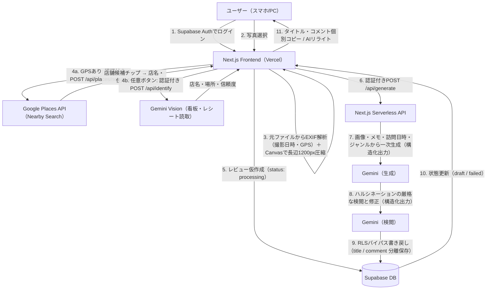

# 食べログ下書き生成・管理アプリ 完全仕様・開発プロセス報告書

本ドキュメントは、本プロジェクトで構築した「食べログ下書き生成・管理アプリ」の最終システム仕様、セキュリティ設計、AIワークフローのプロンプト設計、およびこれまでの開発プロセスと実装履歴をまとめた完全リファレンスです。

---

## 1. システム全体設計 ＆ アーキテクチャ

本システムは、セキュリティ保護（プライベートデータ保護）、運用コスト最小化（フル解像度画像は保存せず、サムネイルのみを無料枠内に格納）、および食べログの規約遵守を同時に満たすWebアプリケーションです。

### 全体アーキテクチャ・データフロー


---

## 2. データベース設計 (Supabase)

AI解析用のフル解像度画像はクラウド上に永続保存せず、ブラウザ側からBase64形式で一時的にAPIに渡します。永続保存するのは表示用の320pxサムネイルのみで、非公開のStorageバケットに格納します（詳細は §2.3）。

### 2.1 テーブル定義: `tabelog_reviews`
| カラム名 | 型 | 制約 | 説明 |
| :--- | :--- | :--- | :--- |
| `id` | `uuid` | `PRIMARY KEY`, `DEFAULT gen_random_uuid()` | レコードの一意識別子 |
| `user_id` | `uuid` | `NOT NULL`, `references auth.users` | Supabase AuthのユーザーID（所有者を識別） |
| `shop_name` | `varchar` | `NOT NULL` | 店舗名 |
| `rating` | `numeric` | `NOT NULL`, `check (rating >= 1.0 and rating <= 5.0)` | 評価（1.0 〜 5.0） |
| `raw_memo` | `text` | `NULL` | ユーザーが入力した任意の体験メモ |
| `generated_review` | `text` | `NULL` | AIレビューの全文（「タイトル：…\nコメント：…」形式。旧レコード互換用） |
| `review_title` | `text` | `NULL` | AIレビューのタイトル（構造化出力から保存） |
| `review_comment` | `text` | `NULL` | AIレビューのコメント本文（構造化出力から保存） |
| `status` | `varchar` | `DEFAULT 'processing'`, `check (status in (...))` | 状態管理（`processing` / `draft` / `failed` / `posted_tabelog` / `posted_google` / `posted`） |
| `visit_date` | `date` | `NULL` | 訪問日（写真のEXIF撮影日から自動設定、手動修正可） |
| `visit_time` | `time` | `NULL` | 訪問時刻（EXIF撮影時刻から自動設定。AIプロンプトの時間帯文脈に使用） |
| `place_id` | `text` | `NULL` | 選択されたGoogle PlaceのID（表記ゆれのない店舗の一意キー。再訪検知・制覇マップの布石） |
| `place_lat` / `place_lng` | `double precision` | `NULL` | 選択された店舗の座標（写真の生GPSは保存しない） |
| `place_genre` | `text` | `NULL` | 店舗ジャンル（例: ラーメン屋）。AIプロンプトの文脈に使用 |
| `shop_location` | `text` | `NULL` | 店の場所の説明（例:「東京都中央区銀座付近」。AI推定・手入力可） |
| `latitude` / `longitude` | `double precision` | `NULL` | 写真のEXIF GPS座標（カードの地図リンクのフォールバックに使用） |
| `photo_thumbs` | `text[]` | `NULL` | サムネイルのStorageパス配列（`{user_id}/{review_id}/{0..2}.jpg`） |
| `private_memo` | `text` | `NULL` | 非公開の自分用メモ（投稿にもAIプロンプトにも使用しない） |
| `review_drafts` | `jsonb` | `NULL` | 生成された全下書き案 `[{title, comment} ×3]`。`review_title`/`review_comment` は選択中の案 |
| `created_at` | `timestamptz`| `DEFAULT now()` | レコード作成日時 |

### 2.2 セキュリティ設計 (RLS Policy)
Supabaseの「Row Level Security (RLS)」を有効化し、**ログインしている本人しかデータを「参照・作成・編集・削除」できない**ポリシーを設定しています。
- **SELECT / INSERT / UPDATE / DELETE**: `auth.uid() = user_id` である場合のみ許可。
- **API書き戻し時のバイパス**: サーバーサイドAPIでは、管理用秘密鍵（`SUPABASE_SERVICE_ROLE_KEY`）を使用することでRLSを安全にバイパスし、レビュー文の書き戻しを行います。
- **マイグレーション管理**: スキーマ変更はすべて `supabase/migrations/` のSQLファイルで管理しています（適用はSupabaseダッシュボードのSQL Editorまたは `supabase db push`）。

### 2.3 サムネイルストレージ（Supabase Storage）
「ストレージ完全不要」の原則を「**サムネイルのみ・無料枠内**」に緩和し、アップロード写真の長辺320px・JPEG品質70%のサムネイル（1枚約15〜35KB）を非公開バケット `review-thumbs` に保存します。フル解像度は引き続き保存しません。

- **パス規約**: `{user_id}/{review_id}/{0..2}.jpg`。Storage RLSでパス第1セグメント＝`auth.uid()` の本人のみSELECT/INSERT/UPDATE/DELETE可
- **表示**: クライアントが署名付きURL（TTL 1時間）を一括取得し、`loading="lazy"` で遅延読み込み
- **ベストエフォート設計**: アップロードはAI生成と並行実行し、失敗しても生成フローを止めない。バケット未作成環境ではサムネイルが表示されないだけでアプリは正常動作
- **削除**: レビュー削除時にStorageオブジェクトもベストエフォートで削除（失敗時は孤児として許容。ダッシュボードのStorage画面から手動削除可能）
- **容量目安**: 1レビュー≈最大100KB → 無料枠1GBで約1万レビュー分

### 2.4 環境変数
| 変数名 | 用途 | 公開範囲 |
| :--- | :--- | :--- |
| `NEXT_PUBLIC_SUPABASE_URL` | SupabaseプロジェクトURL | クライアント公開 |
| `NEXT_PUBLIC_SUPABASE_ANON_KEY` | Supabase匿名キー（RLS適用） | クライアント公開 |
| `SUPABASE_SERVICE_ROLE_KEY` | RLSバイパス用の管理キー（レビュー書き戻し） | **サーバーのみ** |
| `GEMINI_API_KEY` | Google Gemini APIキー（生成・検閲・リライト・店舗推定） | **サーバーのみ** |
| `GEMINI_MODEL` | 使用モデルの上書き（省略時 `gemini-2.0-flash`） | サーバーのみ・任意 |
| `GOOGLE_PLACES_API_KEY` | Google Places API (New) キー（GPS店舗自動特定） | **サーバーのみ** |

※ `GOOGLE_PLACES_API_KEY` が未設定でもアプリは動作します（店舗候補が表示されず手入力になるだけ）。キーには「Places API (New) のみ」のAPI制限と、`SearchNearbyRequest per day` のクォータ上限設定を推奨します。

---

## 3. フロントエンド仕様 ＆ UI/UX設計

### 3.1 Gourmet Modern デザインシステム
- **テーマ**: 食べログを意識した上品な温かみのあるオレンジ（`#f97316`）とアンバー/ゴールド（`#eab308`）をアクセントとした高級ダークトーン（`#0c0a09`）。
- **グラスモルフィズム**: カードに半透明の背景（`rgba(28, 25, 23, 0.65)`）と微細なブレア（`blur(12px)`）、光沢のあるボーダーを適用。
- **モバイルレスポンシブ**: スマホ画面ではログアウトボタンが潰れるのを防ぐため、文字を非表示にしてスクエア型のスタイリッシュなアイコン（扉マーク）に自動切り替え。メールアドレスも非表示にし、ヘッダーをスッキリ配置。
- **横はみ出し対策（iOS Safari）**: グリッド／フレックスアイテムの既定値 `min-width: auto` が原因の右はみ出しを防ぐため、`.mainGrid` の子とカードヘッダーの店名側カラムに `min-width: 0` を設定。フォーム部品には `max-width: 100%` のガード、ステータスバッジには `flex-shrink: 0; white-space: nowrap` を適用し、狭い画面でも全要素がビューポート内に収まります。

### 3.2 投稿フォームと画像処理
- **点数入力 (0.2刻み)**: スライダー(`step="0.2"`)で評価を設定でき、星マークが「全星」と「半星」でダイナミックに表現されます。
- **複数画像アップロード (最大3枚)**: 
  - HTML5 Canvasを用い、スマホのカメラやライブラリから選択された画像を**最大長辺1200px**に並列で自動リサイズ・圧縮（JPEG 85%品質）。
  - アップロードされた画像はサムネイルリストで並び、個別に `×` ボタンで削除可能です。
- **サムネイルの保存とカード表示（グルメアルバム化）**:
  - 同じ元ファイルから長辺320pxのサムネイルも生成し、投稿時にSupabase Storageへ保存。レビューカードに最大3枚横並びで表示され、一覧が「自分のグルメアルバム」として機能します（詳細は §2.3）。
  - 保存はAI生成と並行のベストエフォートで、投稿の体感速度に影響しません。写真を保存していない旧レコードは従来通りの表示です。
- **GPS店舗自動特定（写真を選ぶだけで店名が埋まる）**:
  - 元ファイルのEXIF GPS座標から、認証付きAPI `/api/places/nearby` 経由でGoogle Places API (New) Nearby Searchを呼び出し、半径100m以内の飲食店候補を最大5件取得します（距離順・日本語・飲食系タイプ限定）。
  - 第1候補が**50m以内**の場合のみ店名を自動入力し、候補は常にチップとして店名欄の下に表示。タップで差し替え、手入力すると自動入力は解除されます（手入力を上書きしない設計）。
  - FieldMaskをPro SKUフィールドのみに限定し、**月5,000回の無料枠**内で運用（Enterpriseフィールドを要求すると無料枠が1,000回に減るため意図的に制限）。
  - APIキーはサーバー側環境変数 `GOOGLE_PLACES_API_KEY` に保持し、認証済みユーザーのみ呼び出し可能。GPSなし写真・候補なし・APIエラー時は静かに手入力へフォールバックします。
  - 選択された店舗の `place_id`・座標・ジャンルをDBに保存。
- **AI店舗推定（写真の看板・レシートから読取）**:
  - 「写真からお店の名前・場所を推定」ボタンで、Gemini Visionが看板・のれん・レシート・箸袋などの文字を読み取り、店名と場所を構造化出力 `{shop_name, location, confidence}` で推定します（認証付き `/api/identify`）。
  - **GPSのない写真でも動作**するため、Places API検索の補完手段になります。結果には信頼度（高/中/低）の注意書きを表示し、必ずユーザーが確認・修正できる下書き扱いです。
  - **場所のハルシネーション対策**: GPS座標はGeminiに渡しません（LLMは座標から地名を復元できず、誤った住所を生成するため）。場所は**画像内に住所・地名が実際に写っている場合のみ**出力を許可し、チェーン店名の知識等からの推測は禁止。さらにクライアント側でも、Places候補由来・手入力済みの場所は上書きせず空欄のみ補完します。
  - 推定・手入力した「場所」はレビューカードのメタ情報に表示され、座標（選択店舗優先、なければ写真GPS）があれば地図リンクになります。
- **訪問日時の自動抽出（EXIF）**:
  - 選択された**元ファイル**のEXIF（`DateTimeOriginal`）から撮影日と撮影時刻を読み取り、訪問日フィールド（および内部の訪問時刻）に自動セットします（Canvasリサイズ後の画像はEXIFが失われるため、必ずリサイズ前のファイルから抽出）。
  - 訪問日時はAIプロンプトに「2026年6月13日 19時ごろ」の形式で渡され、季節や時間帯（ランチ／ディナーなど）を踏まえた自然なレビュー生成に活用されます。
  - 写真の追加・削除時には各写真の撮影日リストから再計算し、1枚目を優先採用。撮影日を持つ写真がない場合は手入力値を据え置き、写真が0枚になるとクリアします。
  - 訪問日は手動でも修正可能で、レビューカードのメタ情報に表示されます。

### 3.3 投稿の効率化アクション
- **ワンタップGoogleマップ投稿**: `place_id` を持つレビューには「Googleマップに投稿」ボタンが表示され、**コメントをクリップボードにコピーしつつ、その店舗のクチコミ投稿画面（`https://search.google.com/local/writereview?placeid=…`）を直接開きます**。「コピー→アプリ切替→店を検索→ペースト」の手作業が「開いてペースト」だけになります（Googleマップのクチコミにはタイトル欄がないためコメントのみコピー。モバイルでは投稿アクション群の最上部に配置）。
  - **コピーの確実性**: ページ遷移と競合しない同期コピーAPIを優先し、成功した場合のみ遷移。失敗時は遷移を止めて非同期APIで再試行し、それでも失敗した場合は通知します（未コピーのまま投稿画面だけが開く事故を防ぐ設計）。
  - **iOSではGoogleマップアプリを起動**: PWAだと外部リンクがブラウザシートで開き閉じる手間があるため、iOSではコピー完了後に `comgooglemaps://` スキームで**アプリの該当店舗画面**（店名＋保存座標で検索）を直接起動します。アプリ未インストール等で起動しない場合は1.2秒後にWebの投稿フォームへ自動フォールバック。iOS以外は従来通りWebフォームを開きます。
- **Googleマップ連携**: カード内の店名をクリックすると、新しいタブでGoogle Mapsの検索結果が開き、お店の位置や詳細情報を即座に確認できます。
- **「食べログで検索」リンク（iOSユニバーサルリンク対策済）**:
  - iOS端末で食べログアプリが勝手に起動して検索クエリが失われる現象を防ぐため、**「Google検索（店舗名 ＋ 食べログ）」のURLを中継**して開くように設計。Safari内で100%確実に検索結果を表示させます。
- **個別コピーボタン**: AIが構造化出力で返した「タイトル」と「コメント」（旧レコードはテキストパースでフォールバック）を、個別のコピーボタンでクリップボードに格納できます。
- **文字数カウンターと警告**: タイトル・コメントの両方に文字数カウンターを表示。タイトルが食べログの上限30文字を超えると赤字で警告し、コメントが目安の150文字を超えるとアンバーで注意表示します。
- **二連の投稿完了ボタン（食べログ完了 / Googleマップ完了）**:
  - どちらの媒体へ投稿したかを個別に管理し、両方完了するまで「未投稿」タブに残る仕様です。
  - ボタンは**トグル式**で、誤って完了にした場合はもう一度押すことで取り消せます（両方取り消すと `draft` に戻ります）。
- **店舗名のインライン編集**: レビューカード上の編集アイコンから店舗名を直接修正できます（Enterで保存 / Escapeでキャンセル）。
- **評価のインライン編集**: カードの星表示横の編集アイコンから、0.2刻みのスライダーで評価を後から変更できます（星のプレビューがリアルタイムに追従。変更してもレビュー本文は自動では変わらないため、本文も合わせたい場合はAIリライトを利用）。
- **再訪検知**: 店舗候補を選択すると、同じ `place_id` の過去レビューを検索し「この店は2回目の訪問です（前回: ★3.6・日付）」と前回の自分用メモを表示。生成・リライトプロンプトにも再訪情報が確認済みの事実として渡され、AIが「再訪」を自然に踏まえられます（前回との比較の捏造は禁止）。
- **マルチドラフト（3案生成）**: 生成時に文体の異なる3案（①淡々簡潔 ②描写多め ③カジュアル一言風）を作成し、カード上部の「案1/案2/案3」チップでタップ切替。選択した案が `review_title`/`review_comment` に反映され、コピー・投稿の対象になります（リライト後もチップから元の案に戻せます）。
- **自分用メモ（非公開・二層レビュー）**: カードごとに「次は塩を頼む」のような非公開メモを追加・編集可能。**投稿にもAIプロンプトにも一切使われません**。再訪時にはフォームに前回のメモが表示されます。
- **音声メモ入力**: 対応ブラウザでは体験メモ欄にマイクボタンが表示され、話した内容が「・」付きの箇条書きで追記されます（Web Speech API・無料・キー不要。非対応ブラウザではボタン自体が出ません）。
- **生成失敗のハンドリング**: AI生成が失敗した場合、レコードは `processing` のまま固まらず `failed` ステータスに更新され、「生成失敗」バッジ付きでカードに残ります（削除して再作成が可能）。サーバー側・クライアント側の双方でフェイルセーフに更新します。
- **一覧の検索・並べ替え**: タブの下の検索ボックスで店舗名・場所を部分一致検索（「あの店もう書いたっけ？」の確認・重複投稿防止）。並べ替えは「作成が新しい順（既定）／訪問日が新しい順／評価が高い順／評価が低い順」から選択できます（訪問日未設定のレコードは作成日時で代替）。

---

## 4. AI ワークフロー設定 (API Route)

`gemini-2.0-flash`（`GEMINI_MODEL` 環境変数で変更可）を使用します。中核は「生成→検閲」の2段階パイプライン（`/api/generate`）で、補助として「AIリライト」（`/api/rewrite`）と「店舗推定」（`/api/identify`）があります。すべてのAIエンドポイントは `verifyAuth` によるJWT検証必須です。

### 4.0 構造化出力（JSON Schema）
すべてのAI呼び出し（生成・検閲・リライト）は `responseSchema` による**構造化出力**を使用し、`{ "title": "...", "comment": "..." }` のJSONを直接返させます。これにより「タイトル：〜」形式のテキストを正規表現でパースする必要がなくなり、パース崩れが原理的に発生しません。結果は `review_title` / `review_comment` カラムに保存され、`generated_review` には旧形式の全文（互換用）も併せて書き込まれます。

### 4.1 AI Vision（生成プロンプト）
アップロードされた複数の画像・体験メモ・訪問日時をインプットし、ハルシネーション（創作表現）を厳しく禁止しながら130文字程度のレビュー下書きを生成します。

```text
あなたは食べログの口コミレビュー作成アシスタントです。
提供された【画像（料理や店舗外観など、最大3枚）】と、ユーザーからの【体験メモ（入力がない場合は空）】を厳密に解析し、以下の指示に従って淡々とした短いレビュー（下書き）を作成してください。

【厳守すべき指示】
1. 出力形式: レビューのタイトルを「title」フィールドに、コメント本文を「comment」フィールドに出力してください。
2. 文字数制限: コメント部分（本文）は130文字程度（目安100文字〜150文字程度）の簡潔な文章にしてください。
3. トーン＆マナー:
   - お店のPRではない、一般客としての自然で淡々とした普通の温度感で記述してください。
   - 「とても美味しい」「最高」「絶品」などの過剰な褒め言葉や、かしこまった敬語表現は避け、普段メモに書き残すようなフラットで普通のトーン（例：「〜でした」「〜のようです」）にしてください。
4. 禁止事項:
   - 店舗名および住所は、タイトルやコメント（本文）の中に絶対に含めないでください。
   - 提供された全ての画像と体験メモから確認できる情報のみを使用し、確認できない情報（接客態度、店内の隠れた雰囲気、素材の産地や化学調味料など）を想像で捏造しないこと。
5. 内容:
   - アップロードされた画像から得られる視覚的特徴（具材、盛り付け、色合いなど）から客観的に考えられる感想。
   - 体験メモがある場合は、そこに書かれている事実を自然に反映させてください。
   - 訪問日時の情報がある場合は、季節や時間帯（ランチ／ディナーなど）の文脈として自然に活かして構いません（無理に言及する必要はなく、日付そのものを羅列しないこと）。
   - ただし、「6月に訪問」「先日の夜に」「休日のランチで」など、時期・時間帯の表現を**コメントの書き出し（1文目の冒頭）に置くことは禁止**します。コメントは料理や体験の内容から書き始め、時期に触れる場合は文中で自然に触れる程度にしてください。
```

※プロンプト末尾の【食事情報】には、店舗名・評価に加えて訪問日時（例：`2026年6月13日 19時ごろ`）が含まれます。

### 4.2 AI Prompt（検閲・ファクトチェックプロンプト）
一次生成されたドラフト（title / comment）とユーザーの体験メモを比較し、嘘の褒め言葉やハルシネーションを最終修正します。

```text
あなたは極めて厳格なレビュー検閲官です。前段のAIが作成した【生成レビュー下書き】と、ユーザーの【体験メモ】を対比し、以下の検閲・修正ルールに従って最終的なレビュー文を修正してください。

【検閲・修正ルール】
1. 文字数の調整: コメント（本文）の部分が130文字程度になっていることを確認してください。長すぎる場合は簡潔に削り、短すぎる場合は画像の特徴に基づく自然な描写を少し補ってください。
2. 禁止事項の徹底排除:
   - 店舗名（${shop_name}）や住所が、タイトルおよびコメントに含まれている場合は完全に削除してください。
   - 画像および体験メモから確認できないハルシネーション（勝手な想像）はすべて削除または修正してください。ただし下記の訪問日時は確認済みの事実であり、それに基づく季節・時間帯（ランチ／ディナーなど）への自然な言及は削除しないでください。
3. トーンの調整:
   - お店のPR広告のような響きを一切排除し、淡々とした普通の温度感の日本語に修正してください。
4. 書き出しの調整:
   - コメントが「◯月に」「〜頃に」「先日」「休日の夜に」など訪問時期・時間帯の表現から始まっている場合は、料理や体験の内容から始まる書き出しに必ず修正してください（時期への言及は文中に移すか削除）。

【出力ルール】
検閲と修正を完了した、最終的な安全な食べログ用レビューのタイトルを「title」フィールドに、コメント本文を「comment」フィールドに出力してください。挨拶、説明、修正履歴などは一切含めないでください。
```

### 4.3 AIリライト（`/api/rewrite`）
生成済みレビューに対するユーザーの自由指示（例：「もっと短く」「カジュアルに」）を反映して再生成します。DBに保存済みの食事情報（店舗名・ジャンル・評価・メモ・訪問日時）と現在のレビューを文脈として渡し、生成時と同じ検閲ルール（店舗名・住所の排除、ハルシネーション禁止、書き出しの時期表現禁止※ユーザーが明示指示した場合を除く）を適用した上で、`{title, comment}` を構造化出力で返し、`status` を `draft` に戻します。

### 4.4 店舗推定（`/api/identify`）
写真から店名・場所を推定する**提案専用API**です（DBには書き込まず、結果はフォームの下書きとしてユーザーが確認・修正します）。GPS座標は意図的に渡しません — LLMは座標から地名を復元できず誤った住所を生成するため、GPSがある場合の正確な住所はPlaces API候補から取得します。

```text
あなたは写真から飲食店を特定するアシスタントです。
提供された【画像（最大3枚）】を解析し、その店の「店名」と「場所」を推定してください。

【解析の手がかり】
- 看板・のれん・店頭サイン・提灯などに写っている店名の文字
- レシート・伝票・箸袋・おしぼり・コースター・メニューに印字された店名・住所・ロゴ

【出力ルール】
1. shop_name: 推定した店名。画像内の文字から読み取れた場合はそのまま使用してください。確実な手がかりがなく推定できない場合は空文字にしてください。存在しない店名を創作しないこと。
2. location: 店の場所の説明（例：「東京都中央区銀座付近」）。**画像内に住所・地名が実際に写っている場合のみ**（レシートに印字された住所、看板の「◯◯店」表記など）、その読み取った内容に基づいて記述してください。
   - 店名に関する既存知識（チェーン店の所在地など）や、料理・内装の雰囲気から場所を推測することは絶対に禁止します。
   - 画像から住所・地名を直接確認できない場合は、必ず空文字にしてください。
3. confidence: 推定の信頼度。
   - high: 画像内の文字（看板・レシート等）で店名を直接確認できた
   - medium: 間接的な手がかり（ロゴ・特徴的な内外装など）から高い確度で推定できた
   - low: 推測の域を出ない、または店名を特定できなかった
```

### 4.5 店舗検索（`/api/places/nearby`・AI以外）
Google Places API (New) Nearby Searchへの認証付きプロキシです。写真のEXIF GPS座標を受け取り、半径100m以内の飲食店候補（最大5件・距離順・日本語）を返します。APIキーをサーバー側に隔離し、FieldMaskをPro SKUフィールドに限定することで月5,000回の無料枠内で運用します。

---

## 5. 開発プロセス ＆ アップデート履歴

本アプリケーションは、ユーザー（あなた）とAIアシスタント（Antigravity）の対話を通じて段階的に機能拡張を行いました。

### 第1フェーズ: 基盤構築
1. **Next.jsの初期化**: App Router + TypeScript + Vanilla CSSのクリーンな構成でスタート。
2. **Supabase連携**: 認証・データベース・RLSポリシーの初期マイグレーションファイルを作成。
3. **AI Vision & Prompt連携**: Gemini APIを用いて、画像をBase64形式で受けてレビューを生成するAPI Routeと、ログインからダッシュボード操作を行うフロント画面を構築。
4. **Vercel対応**: ビルド時に環境変数がなくてもプリレンダーがクラッシュしないよう、`lib/supabase.ts` にプレースホルダーを設定するビルドセーフ設計を導入。

### 第2フェーズ: ユーザビリティの革新（複数画像・評価詳細化・個別コピー）
1. **評価の0.2刻み対応**: 星ボタンのみだった評価UIを、0.2刻みのスライダーUIに変更。`StarHalf`（半星）を使って小数点のスコアをビジュアルで表現。
2. **最大3枚の写真アップロード**: Canvasリサイズ処理を複数枚対応へ並列化し、サムネイル一覧と個別削除機能を実装。Gemini APIへ画像配列（`images_base64`）を渡すようAPIもアップグレード。
3. **コピー機能の細分化**: レビュー文をタイトルとコメントにパースし、個別のコピーボタンを設置。

### 第3フェーズ: スマートフォン向け最適化と検索連携の改善
1. **文字数メーターの追加**: コメントの横にリアルタイムな文字数を「コメント (132文字)」のように自動で表示させ、確認を容易にしました。
2. **スマホヘッダーのスタイリッシュ化**: スマホの狭い横幅でログアウトボタンが縦長に潰れる問題を解消するため、メールアドレスの非表示化とログアウトボタンのアイコン化（レスポンシブメディアクエリ）を適用。
3. **食べログ連携バグの修正（iOS対策）**:
   - `tabelog.com` の検索URLを直接開くとiOSのユニバーサルリンク機能によりアプリが誤作動する問題を回避するため、**「Googleで『[店舗名] 食べログ』を検索した結果ページ」**に遷移先を変更。Safariブラウザ上で目的のページに100%辿り着くアプローチを採用。
4. **二重投稿ステータス**: 食べログとGoogle Mapsへの投稿状態を個別にチェックできるステータス(`posted_tabelog`, `posted_google`)をDBに反映するマイグレーションを実施。

### 第4フェーズ: 訪問日連携・編集機能・堅牢化
1. **訪問日のEXIF自動抽出**: 写真の撮影日（`DateTimeOriginal`）から訪問日を自動セットする機能と `visit_date` カラムを追加。リサイズ後のCanvas画像ではEXIFが失われるため、リサイズ前の元ファイルから抽出し、写真ごとの撮影日を並行管理する方式に修正。
2. **店舗名のインライン編集**: レビューカード上で店舗名を直接修正できる編集UIを追加。
3. **生成失敗時のフェイルセーフ**: `failed` ステータスを新設し、AI生成エラー時にサーバー側（切断時も含む）とクライアント側の双方でレコードを `failed` に更新。「生成中」のまま固まる問題を解消。
4. **APIの信頼性向上**: `/api/generate` はリクエストボディの店舗名・評価・メモを使わず、所有者確認済みのDBレコードの値をプロンプトに使用するように変更。
5. **投稿完了のトグル化**: 「食べログ完了 / Googleマップ完了」ボタンを押し直すことで完了状態を取り消せるように変更。

### 第5フェーズ: 構造化出力・プロンプト強化・文字数警告
1. **Gemini構造化出力の導入**: 全AI呼び出しに `responseSchema` を設定し、`{title, comment}` のJSONを直接取得。正規表現パースの崩れを原理的に解消し、`review_title` / `review_comment` カラムに分離保存（旧形式の `generated_review` も互換用に併記）。
2. **訪問日時のプロンプト反映**: EXIFから撮影時刻も抽出して `visit_time` カラムに保存し、生成・検閲・リライトの全プロンプトに「2026年6月13日 19時ごろ」形式で提供。検閲段階では確認済み事実として扱い、季節・時間帯への言及が誤って削除されないように調整。
3. **文字数警告**: タイトルに文字数カウンターを追加し、食べログの上限30文字超過時に赤字警告。コメントは目安150文字超過時にアンバーで注意表示。

### 第6フェーズ: GPS店舗自動特定（Google Places API連携）
1. **「写真を選ぶだけ」体験**: EXIFのGPS座標から周辺の飲食店を自動検索し、店名入力を原則ゼロに。候補チップUI＋50m以内での自動入力を実装。
2. **APIキー保護**: Places APIキーをサーバー側に隔離し、`verifyAuth` による認証必須のプロキシRoute（`/api/places/nearby`）経由でのみ呼び出す構成。
3. **コスト設計**: Pro SKUフィールドのみのFieldMask・候補5件上限・半径100m制限により、個人利用で月間無料枠（5,000回）の数%以内に収まる設計。
4. **将来への布石**: `place_id` を保存することで、店名の表記ゆれに依存しない再訪検知・制覇マップ機能の土台を用意。プロンプトには店舗ジャンルを追加し生成文脈を強化。
5. **AI店舗推定の統合（並行セッションの成果を統合）**: 並行開発されていた「Gemini Visionによる看板・レシート読取での店名・場所推定」（`/api/identify`・場所欄・信頼度表示）を、GPS抽出を`photoMeta`に一本化する形で統合。GPSなし写真のフォールバック手段として機能し、未完了だったレビューカードへの場所表示（座標があれば地図リンク）も完成。

### 第7フェーズ: 生成品質チューニングとドキュメント整備
1. **書き出しの時期表現禁止**: 訪問日時をプロンプトに渡すようになった副作用で、コメントが「6月に訪問しました」のような時期表現から始まりがちだった問題を修正。生成・検閲・リライトの3プロンプトに「コメントは料理や体験の内容から書き始める」ルールを追加（検閲段階でも書き出しを強制修正）。
2. **ドキュメント刷新**: `README.md` をNext.js雛形からプロジェクト固有のセットアップガイドに全面書き換え。本ドキュメントもアーキテクチャ図・環境変数一覧・全AIエンドポイントのプロンプト仕様を最新化。
3. **場所推定のハルシネーション修正**: AI店舗推定が実際と全く異なる住所（例: 防府市）を返す問題を修正。原因は「GPS座標の地名をLLMに記述させる」設計（LLMは座標を復元できない）と、チェーン店名の知識からの場所推測。GPSをプロンプトから撤廃し、場所は画像内に写っている住所・地名のみに制限。クライアント側もPlaces由来・手入力済みの場所を上書きしない仕様に変更し、Places候補の自動選択時には正確な住所を場所欄へ自動補完。
4. **レビューの手動インライン編集**: タイトル・コメントをAIリライトを経由せずカード上で直接編集できる編集ボタンを追加（Enter/Escape対応・空保存ブロック・`generated_review` 同期）。

### 第8フェーズ: モバイルPWA対応とアプリアイコン刷新
1. **モバイルPWA（スタンドアロン）化**:
   - [app/manifest.json](file:///c:/Users/fkmkz/OneDrive/ドキュメント/antigravity/tabelog/app/manifest.json) を追加し、Web App Manifest 仕様に対応。
   - `display: "standalone"` を設定し、スマートフォンのホーム画面から起動した際にブラウザの枠やアドレスバーのない全画面（ネイティブアプリ風）で起動・表示できるように最適化。
   - アプリのテーマ「Gourmet Modern」に合わせ、背景色 (`#0c0a09`) とテーマカラー (`#f97316`) をマニフェスト内で同期。
2. **プレミアムアプリアイコンの導入**:
   - AIで生成した高解像度のプレミアムアイコン（Gourmet Modernテーマを基調とした、ゴールドとオレンジのグラデーションによる立体的な「T」の文字とフォークのシルエット）を導入。
   - iOSホーム画面用アプリアイコン（apple-touch-icon）として [app/apple-icon.png](file:///c:/Users/fkmkz/OneDrive/ドキュメント/antigravity/tabelog/app/apple-icon.png) を配置。
   - 一般ブラウザ・Androidのアイコンとして [app/icon.png](file:///c:/Users/fkmkz/OneDrive/ドキュメント/antigravity/tabelog/app/icon.png) を配置し、マニフェストとHTMLヘッダーに自動インジェクション。

### 第9フェーズ: 写真サムネイル保存（グルメアルバム化）
1. **「ストレージ完全不要」原則の緩和**: 長辺320pxのサムネイルのみをSupabase Storage非公開バケットに保存する設計に変更（1レビュー≈最大100KB、無料枠1GBで約1万レビュー分）。フル解像度は引き続き非保存。
2. **カードのアルバム表示**: レビューカードにサムネイルを最大3枚表示し、一覧を「自分のグルメアルバム」化。署名付きURL＋遅延読み込みで一覧クエリを重くしない設計。
3. **ベストエフォート統合**: 保存はAI生成と並行実行し、失敗・バケット未作成でも生成フローとカード表示は正常動作。レビュー削除時はStorageも掃除。

### 第10フェーズ: ワンタップGoogleマップ投稿
1. **place_id資産の回収**: GPS店舗特定で保存してきた `place_id` を使い、Googleマップの該当店舗クチコミ投稿画面（`writereview?placeid=…`）を直接開くボタンを追加。クリック時にコメントを自動コピーし、投稿フローの最終区間（コピー→アプリ切替→店を検索→ペースト）を「開いてペースト」に短縮。
2. **実装の要点**: アンカーのネイティブ遷移＋onClickコピーの組み合わせで、ポップアップブロックとクリップボードのフォーカス喪失の両方を回避。モバイルでは投稿アクション群の最上部に配置。

### 第11フェーズ: 記憶と選択肢（再訪検知・自分用メモ・音声入力・3案生成）
1. **再訪検知**: `place_id` 資産の3度目の回収。過去訪問をフォーム表示＋プロンプト反映（`lib/revisit.ts` を生成・リライトで共用）。
2. **二層レビュー**: 非公開の `private_memo` を新設し、投稿・AIから完全に分離した自分用の記憶レイヤーを追加。再訪検知と連動して前回メモを提示。
3. **音声メモ入力**: Web Speech APIによる日本語音声入力（`useSyncExternalStore` でハイドレーション安全に対応判定）。
4. **マルチドラフト生成**: 生成・検閲の両段を3案対応の構造化出力（`drafts`配列）に拡張し、`review_drafts` に全案保存。カードの案チップでワンタップ切替。

### 第12フェーズ: モバイルレイアウト修正（iPhone実機フィードバック対応）
1. **画面全体の右はみ出し修正**: iPhone（iOS Safari）でダッシュボード全体が画面右にはみ出す問題を修正。原因は `.mainGrid` のグリッドアイテム（フォーム／一覧セクション）が既定値 `min-width: auto` のままで、WebKitがフォーム部品の固有最小幅を縮小せず、1カラムのグリッドトラックがビューポートより広がっていたこと（Blink系では再現しないiOS固有の挙動）。`.mainGrid > *` に `min-width: 0` を追加し、`.form-control` と店名編集入力に `max-width: 100%` のガードを設定。
2. **「すべて投稿済」バッジのはみ出し修正**: 投稿完了カードのステータスバッジが押し潰されて縦3行に折り返し、カード右外へはみ出す問題を修正。原因は `.cardHeader`（`space-between` のフレックス行）の店名・メタ情報カラムが `min-width: auto` のため縮まず、バッジを押し出していたこと。店名側カラムに `min-width: 0; flex: 1`、`.statusBadge` に `flex-shrink: 0; white-space: nowrap` を設定し、バッジが常に1行・全幅で表示されるように変更（ヘッドレスブラウザの393px再現テストで修正前61px高の縦折れ→修正後27px高の1行表示を確認）。

### 第13フェーズ: 生成文への具体的日付の混入防止
1. **症状と原因**: 生成レビューの文中に「2026年7月15日の夜に初めて利用しましたが」のような具体的な日付が入り込むようになった。第7フェーズの修正は「書き出し（1文目の冒頭）の時期表現」のみの禁止で、**文中**のリテラル日付はカバー外。さらに検閲段は訪問日時を「確認済みの事実」として保護するルールになっており、生成段で混入した日付が検閲を素通り（温存）していた。プロンプトに「2026年7月15日 19時ごろ」というリテラル日付を渡していたことがコピーの直接の誘因。
2. **対策（三層防御）**:
   - **入力の曖昧化（構造的防御）**: プロンプトに渡す訪問日時を「7月中旬の夜（ディナー）」のような曖昧表現に変更（`describeVisitDateTime` を上旬/中旬/下旬＋朝/昼/夕方/夜/深夜の粒度に）。再訪情報の「前回の訪問日」も同じ曖昧化を適用。モデルは日付を知らないため原理的にコピー不可能。
   - **生成・リライトの禁止事項**: 「具体的な日付（年月日・月日の表記）をタイトル・コメントに含めない」を明記。
   - **検閲ルール**: 具体的な日付表記が含まれる場合は削除または「◯月中旬」「夜」など季節・時間帯レベルへの言い換えを必須化。
   季節・時間帯（ランチ／ディナー等）への自然な言及は従来通り許容（意図された仕様）。

### 第14フェーズ: ワンタップGoogleマップ投稿のアプリ起動対応（iOS）
1. **課題**: PWA（スタンドアロン）から「Googleマップに投稿」を押すと外部リンクがブラウザ（アプリ内ブラウザシート等）で開き、下書き画面に戻るには閉じる操作が必要で使いづらい。Googleのクチコミ投稿は必ずGoogleのサイト/アプリ上で行う必要があるため往復自体はなくせないが、戻りの負担を軽減したい。
2. **対応**: iOSではコメントのコピー完了後に `comgooglemaps://` URLスキームで**Googleマップアプリを直接起動**（店名＋保存済み座標 `center` で該当店舗を表示。アプリなら画面左上の「◀」やアプリスイッチャーで即座に元の画面状態のまま戻れる）。スキームには投稿フォーム直行のパラメータが存在しないため、着地は店舗画面（「クチコミ」タブから投稿）。起動後1.2秒たっても画面が表示されたまま（＝アプリ未インストール等）の場合は、従来のWeb投稿フォーム（`writereview` URL）へ自動フォールバック。iOS以外は従来動作（同期コピー＋ネイティブ遷移）のまま。

### 第15フェーズ: 画面設計ブラッシュアップ第1弾（モバイル動線の最短化）
機能一巡後のUX改善として、モバイル（PWA）の「開く→確認→投稿」動線を最短にする3点をワンセットで実施。テーマ（Gourmet Modern）・機能・DBは不変更で、レイアウトとCSSのみ。
1. **一覧⇄作成の2画面化**: モバイル（≤900px）に固定の下部タブバー（一覧／作成）を新設し、開くとまず一覧が表示される構成に変更。生成開始時は自動で一覧に切り替えて新規カードを展開表示。`env(safe-area-inset-bottom)` でホームバーを回避。デスクトップは従来の2カラムのまま。
2. **カードのダイジェスト化**: 一覧ではカードを「サムネイル・店名・星・ステータスバッジ・訪問日」の1行表示にし、タップで展開（同時に開くのは1枚）。日付順ソート時は「2026年7月」の月見出しでグルーピングし、1画面あたりの視認件数を大幅に向上。
3. **アクションの整理**: 展開カードの操作を「状態に応じた主ボタン1つ（Googleマップに投稿→食べログ済にする→Googleマップ済にする→すべて投稿済）＋『⋯』メニュー（完了トグル・リライト・削除）」に再構成。次にやるべき操作が常に1つだけ見える。生成前のカード（生成中・失敗）は従来通り削除ボタンのみ。

### 第16フェーズ: 画面設計ブラッシュアップ第2弾（読みやすさと通知の改善）
第15フェーズに続くUX改善。テーマ・機能・DBは不変更。
1. **タブ・検索のsticky化**: モバイルでは一覧のタブ（すべて/未投稿/投稿完了）と検索・並べ替えをスクロールしても画面上部に固定表示（背景ぼかし付き）。長い一覧でも絞り込みに即アクセスできる。
2. **作成フォームの3ステップ化**: 自動入力の起点である写真選択を最上部に移動し、「①写真を選ぶ → ②評価 → ③体験メモ」の番号付きステップ構成に再編。写真から店名が自動入力されると「✓ 写真から自動入力」チップを表示して安心感を担保。
3. **文字サイズ・コントラストの底上げ**: 0.68〜0.78remに散らばっていた極小文字を0.72〜0.82remへ引き上げ、`--text-muted` を1段明るく（#78716c → #8a8580）してダーク背景での可読性を改善。
4. **alert()のトースト化**: 9箇所のシステムダイアログ（各種更新失敗・コピー失敗）を画面内トースト（3.5秒で自動消去・下部タブバーの上に表示・エラー/成功の色分け）に置換。PWAでの体験を阻害しない通知に。
